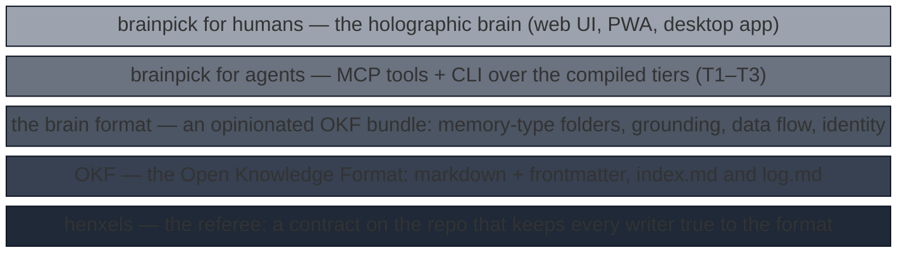

<!-- markdownlint-disable -->
```
   ╭────────────────────╮
   │      ●───●         │
   │     ╱ ╲ ╱ ╲        │   b r a i n p i c k
   │    ●───●───●       │   pick your agent's brain
   │     ╲ ╱ ╲ ╱ ⛏      │   plain markdown in · a living brain out
   │      ●───●         │
   ╰────────────────────╯
```
<!-- markdownlint-enable -->

# brainpick

> **This is a fork.** [sneikki/brainpick](https://github.com/sneikki/brainpick)
> is Nuutti Varvikko's fork of
> [benquemax/brainpick](https://github.com/benquemax/brainpick), branched at
> 0.4.0 and developed on its own roadmap: useful concepts from upstream are
> re-implemented here, not merged. The `brainpick` package on PyPI, the
> release installers and the live demo are upstream's and do not carry this
> fork's changes — install the fork from git (see the quick start).

**A turn-key brain stack for AI agents — plain markdown in, a living
knowledge graph out.** Your agents' knowledge lives as an
[OKF](https://github.com/GoogleCloudPlatform/knowledge-catalog/blob/main/okf/SPEC.md)
bundle of plain markdown files — [henxels](https://github.com/benquemax/henxels)
keeps every writer true to the format — and brainpick compiles it into
tiered, disposable artifacts: a generated index, a link graph, semantic
vectors, an entity graph. Agents consume the compiled brain over
[MCP](https://modelcontextprotocol.io) and the CLI; everything is
local-first, deterministic wherever a model isn't needed, and no server is
ever required.

Humans get a separate, optional face: the **holographic brain**, a web UI
that renders the same compiled graph and updates live while agents write.
It is a window into the brain, never a dependency of it — see upstream's
[live demo](https://benquemax.github.io/brainpick/), its own docs compiled
and served by brainpick itself.


## Listen instead

Five minutes, one voice, no slides: the bet, what a brain is, why the
associations are made at write time, and the two commands that get you
started. Synthesized from the transcript beside it — no human was recorded.

**▶ [Play the episode (mp3, 5 min)](https://benquemax.github.io/brainpick/assets/audio/brainpick-episode.mp3)**
· [transcript](https://github.com/sneikki/brainpick/blob/main/docs/assets/audio/brainpick-episode.txt)


## The hypothesis

A small model with **frictionless access to knowledge and skills that
evolve in real time** becomes a self-improving agent — and not merely as
capable as an agent on a large frontier model, but *more* capable than one
whose large model lacks that access. The large model's knowledge is frozen
at training time; the brain's is corrected the moment an agent notices it
was wrong.

Brainpick is built on that bet. Its target architecture puts *just enough*
intelligence inside the model — reading, reasoning, tool use — and keeps
knowledge and skills **outside** it, in a brain that any agent can read,
ground, and improve as it works:

- **Less VRAM and compute.** Skills and facts are not baked into weights, so
  the model that runs them can be a 27B on your own machine (principle 1),
  not a data-center model. Learning something new is a commit, not a
  fine-tune.
- **A better, more current world model.** A brain is corrected in real
  time by every agent that uses it, grounded to its sources, and refereed
  on every write — where a large model's understanding is as old as its
  training cut-off and as opaque as its weights.
- **More intelligence per kWh.** The same task done by a small model over a
  living brain costs a fraction of the energy of a frontier model rediscovering
  the answer from scratch — and the second time, the answer is a skill.

**A sub-hypothesis: associations are made at write time, by the author,
not extracted afterwards.** When an agent writes to a brain it already has
the relevant pages in its context — it just read them to ground what it is
saying — so the associations come **for free**: it links them, tags them,
and henxels refuses the write if it did not. The knowledge graph is then
*derived* from what the files carry — T1 from the links, T3 from tags and
ghosts — algorithmically, in under a second, on every commit; vectors (T2)
supply the semantic connections nobody wrote, and the similarity gap-detector
joins the two to flag what *should* be linked. Compare the widely used
LLM-extracted graphs (LightRAG, GraphRAG): a model reads the corpus
*retroactively*, without the author's context, to guess at associations the
author already had — expensive enough to run once in a while, outdated from
day one, and re-derived from zero every pass, so nothing an agent learns
today makes tomorrow's graph better. Brainpick ran LightRAG early on and
retired it for exactly that reason
([ADR](https://github.com/sneikki/brainpick/blob/main/docs/reference/adr/similarity-gap-detector.md));
there is no LLM extractor in the mix. A graph the brain's own authors build
as they write is one the brain evolves *with*; a graph extracted from it is
a snapshot of it. Yes, this is reinventing knowledge graphs — on the premise
that the associations belong in the files, where they are made by whoever
knows them best, at the moment they are known.

Everything else in this README is engineering in service of that bet: the
[brain format](https://github.com/sneikki/brainpick/blob/main/spec/85-brain-format.md)
turns notes into memory with a data flow (journals → knowledge → skills),
[henxels](https://github.com/benquemax/henxels) keeps every write true so the
brain can be trusted, and the tiers make retrieval cheap enough that a small
model never has to *remember* — only to *look*. The hypothesis is testable and
we intend to test it: the same tasks, a small model with a brain against a
large one without, measured in outcomes and in watt-hours.


## Principles

1. **Small models are first-class citizens.** If a 27B can't drive it, it
   doesn't ship — few tools, obvious names, forgiving inputs, token-budgeted
   outputs.
2. **The files are the brain.** Markdown + frontmatter is the only source of
   truth; everything compiled is disposable. `rm -rf .brainpick/` loses
   nothing.
3. **Deterministic before generative.** Whatever can be computed without a
   model is computed without a model; LLM layers enrich — they never
   gatekeep.
4. **Agents never tend the index.** Derived state is compiled from
   frontmatter, never hand-maintained. The agent's job is knowledge;
   brainpick's job is bookkeeping.
5. **Every layer is optional except the files.** grep → links → vectors →
   entities: each tier upgrades retrieval, none is load-bearing, every tier
   degrades gracefully to the one below.
6. **One brain, two faces.** Agents and humans consume the same compiled
   truth — the hologram you spin is the graph the agent walks. On every
   screen, installable as a PWA, updated live — never refreshed.
7. **Writes go through the suspenders.** Nothing enters the brain
   unvalidated: henxels referees every write, from a git hook or from
   `brain_write` alike. Brainpick generates, henxels verifies.
8. **One spec, many runtimes.** The compiled brain is a documented,
   runtime-neutral format; pip and npm are native peers (no Python required
   of Node users) kept honest by shared conformance fixtures.
9. **Agent-agnostic by birth.** MCP, CLI, and plain files play no favorites
   among harnesses. In this repo, AGENTS.md is the one agent-facing
   document; CLAUDE.md is just `@AGENTS.md`.
10. **Onboarding is magic, not a manual.** One command from zero to a living
    brain: detect, propose, compile, glow. No API key for the first wow.
11. **Local-first, spec-true.** Offline is a first-class deployment; cloud
    is a convenience. Stay OKF-compliant; push conventions upstream, never
    fork.
12. **Perfect UX and AX are fruits of great DX.** The artifact spec, TDD,
    conformance fixtures, the henxels contract, and codumented docs are how
    the agent- and human-facing surfaces stay perfect.
13. **The family eats its own dog food.** This repo is governed by henxels
    and codumented from day one, and every feature is exercised on a real
    brain — bugs in any sibling tool surface at home first.
14. **A thin view, not a format owner.** Brainpick renders whatever is
    correctly fronted under a root: it reads frontmatter and OKF's reserved
    names, never folder layout. The layout belongs to the template and its
    henxels contract, so a brain born on any version keeps working with
    every later brainpick — the keys it reads are additive-only, never
    renamed, never newly required. A wiki, a brain, or something in between
    all compile the same way.


## The stack

Five layers, each optional, each a strict superset of the one below — the
whole point is that you can stop at any layer and nothing above is owed.



- **henxels** is the foundation: a
  [contract](https://github.com/benquemax/henxels) that makes the layers above
  it *hold* under agent writes — from a git hook or from `brain_write` alike.
  Brainpick itself never requires it (a hand-tended OKF folder compiles fine);
  without it the format is a hope, with it the format is a fact. It also ships
  the templates: `okf-llm-wiki` for a wiki, `brainpick-brain` for a brain.
- **OKF** is the file format: plain markdown, a frontmatter `type`, an
  `index.md`, a `log.md`. Any OKF bundle — a wiki, a docs folder, a pile of
  notes with `type:` — is a valid input to everything above.
- **The brain format** ([spec/85](https://github.com/sneikki/brainpick/blob/main/spec/85-brain-format.md))
  is OKF plus opinions: folders as memory types (`knowledge/ skills/
  journals/ vision/ plans/`, `raw/` for source material), inline grounding,
  a data-flow architecture (journals → knowledge → skills, read in reverse),
  subsidiarity between brains, and an identity other brains can address.
  Brainpick reads it through frontmatter only — the folders are the
  template's, so the format can evolve without breaking older brains.
- **Brainpick for agents** compiles any bundle into the tiers below and
  serves them over MCP and the CLI. Deterministic tiers need nothing;
  vectors need an embedding model; every tier degrades to the one beneath.
- **Brainpick for humans** renders the same compiled graph as a live
  holographic brain — a window, never a dependency.

Read it bottom-up as adoption: govern a folder → make it OKF → shape it as a
brain → give it to your agent → look at it. Read it top-down as
dependency: nothing above depends on anything more than the layer below.


## The tiers

| Tier | What | Needs |
|------|------|-------|
| T0 | grep/glob over the files | nothing |
| T1 | generated `index.md`, link graph, backlinks, tags | nothing (deterministic) |
| T2 | vector search over chunks | an embedding model |
| T3 | entity/relation graph (ghosts, tags, co-occurrence) | nothing — derived from links and tags |


## Quick start

### Give your agent a brain — paste one prompt

Agentic setup is the primary path: your coding agent installs brainpick,
compiles the brain, and wires itself to it. Paste this to the agent:

> Install brainpick from the fork (`uv tool install
> git+https://github.com/sneikki/brainpick#subdirectory=packages/python`, or `pipx install` with the same source).
> In the repo that holds (or should hold) the markdown knowledge base,
> run `brainpick init` — it detects the bundle,
> detects an embedding backend if one is reachable, writes the config, and
> compiles tier 1. If there is no bundle yet, it hands off to henxels:
> `uvx henxels init --template brainpick-brain` for a brain (an agent's
> memory in `_brain/`) or `uvx henxels init --template okf-llm-wiki` for a
> plain wiki (`_wiki/`); then run `brainpick init` again. Then run `brainpick integrate claude-code` (or
> `opencode`, or `agents-md`) to install the Agent Skill and print the
> MCP snippet — wire it into the harness config. From then on, consult the
> brain before grepping: `brain_overview` first, then `brain_search`,
> `brain_read`, `brain_neighbors`. Finally commit the bundle and the
> brainpick config.

No server appears anywhere in that flow: agents talk to `brainpick mcp`
over stdio, spawned on demand by the harness itself. The read tools also
exist as plain CLI verbs (`brainpick search` · `read` · `neighbors` ·
`overview`) for shells, scripts, and CI.

### Manual install

The same journey by hand:

```bash
uv tool install git+https://github.com/sneikki/brainpick#subdirectory=packages/python
# or: pipx install git+https://github.com/sneikki/brainpick#subdirectory=packages/python
brainpick init                   # detect bundle + backends, write config, compile T1
brainpick integrate claude-code  # Agent Skill + the MCP wiring snippet
brainpick search "anything"      # the brain answers from the terminal
```

One-shot flavor works too: `uvx --from git+https://github.com/sneikki/brainpick#subdirectory=packages/python brainpick init`.

### No wiki yet, or a messy one? henxels drives

A brand-new brain or wiki — [henxels](https://github.com/benquemax/henxels)
scaffolds it and installs the contract that keeps every future write true
to the format:

```bash
uvx henxels init --template brainpick-brain    # a brain: _brain/ + contract + brainpick.toml
uvx henxels init --template okf-llm-wiki       # a wiki: _wiki/ + contract (--wiki-dir docs to govern docs/)
```

Say to your agent "install brainpick here, I want a brain" (or "a wiki") and
these are the two commands it runs; `brainpick init` names them whenever it
finds no bundle.

An existing folder of markdown: `henxels init` installs the contract and
`henxels check --all` prints your migration checklist — instructive, one
fix at a time, and an agent can work the list.

### The GUI — see what your agent sees (optional)

Everything above is the whole product as far as agents are concerned. The
GUI is for the humans: the **holographic brain** — search, spin, and
time-travel the same compiled graph the agents walk, updating live with
every write. Nice to have, never required.

- **Zero install** — upstream's [live demo](https://benquemax.github.io/brainpick/)
  is its own docs wiki, baked into a static snapshot and redeployed
  with every release: the real UI, searchable, with the full time machine,
  served by GitHub Pages with no engine behind it.
- **One command** — `brainpick serve --root docs --open` opens the UI over
  any compiled brain. A git install carries no prebuilt UI (releases bundle
  it); from a checkout, `npm run build -w packages/webui` first.
- **The desktop app** — grab an installer from upstream's
  [latest release](https://github.com/benquemax/brainpick/releases) (without
  this fork's changes): Linux
  `Brainpick_*.AppImage` (`chmod +x`, needs system `webkit2gtk-4.1`),
  macOS `Brainpick_*.dmg` (right-click → Open; the build is unsigned),
  Windows `Brainpick_*.msi` (SmartScreen → More info → Run anyway). First
  launch seeds a **demo brain** — remove it any time; it never comes back.
  **Add a brain** takes a repo URL or a local folder, and for a not-yet-OKF
  folder hands you a paste-ready prompt for your coding agent. Prefer a
  terminal or a NAS? The same service runs headless as `brainpickd start`;
  `BRAINPICK_NO_DEMO=1` skips the demo seed.

### Contributors: run the engines from a checkout

Both engines work straight from a clone — Python (the reference
implementation, and the published package) and native Node, no Python
required. The npm registry publish is
[deliberately parked](https://github.com/sneikki/brainpick/blob/main/docs/reference/adr/pypi-first-release.md)
until there is npm-side demand; the engine itself is a full native peer:

```bash
cd packages/python && uv run brainpick serve --root ../../docs --open   # Python
npm run build -w packages/node && node packages/node/dist/cli.js serve --root docs --open   # Node
```


## Status

**Early, and a fork.** The full stack is built; upstream's desktop app is
downloadable from its [Releases](https://github.com/benquemax/brainpick/releases)
for early testers. The vision is committed in
[`_vision.md`](https://github.com/sneikki/brainpick/blob/main/_vision.md);
the milestones (Ensilento → Kaksoisveto → Hologrammi) landed. Upstream's
`brainpick` pip package is [published on PyPI](https://pypi.org/project/brainpick/)
as of v0.1; this fork publishes nothing yet and installs from git. The npm
publish is
[parked by ADR](https://github.com/sneikki/brainpick/blob/main/docs/reference/adr/pypi-first-release.md);
the Node engine ships in-repo as a native peer until npm-side demand shows up.


## Siblings

- [henxels](https://github.com/benquemax/henxels) — suspenders for your
  repo; the referee for every write brainpick compiles.
- [codumentation](https://github.com/benquemax/codumentation) — keeps this
  repository's documentation provably true.


## License

MIT.


